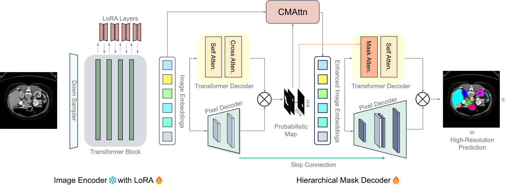

# H-SAM

## Paper

<b>Unleashing the Potential of SAM for Medical Adaptation via Hierarchical Decoding</b> <br/>
[Zhiheng Cheng](https://scholar.google.com/citations?hl=zh-CN&user=JUy6POQAAAAJ), [Qingyue Wei](https://profiles.stanford.edu/qingyue-wei), [Hongru Zhu](https://pages.jh.edu/hzhu38/), [Yan Wang](https://wangyan921.github.io/), [Liangqiong Qu](https://datascience.hku.hk/people/liangqiong-qu/), [Wei Shao](https://mirthai.medicine.ufl.edu/sample-page/the-pi/), and [Yuyin Zhou](https://yuyinzhou.github.io/) <br/>
CVPR 2024 <br/>

[paper](https://arxiv.org/abs/2403.18271) | [code](https://github.com/Cccccczh404/H-SAM)

## 0. Installation

```bash
git clone https://github.com/Cccccczh404/H-SAM.git
```
Please run the following commands to create an environment and obtain requirements.
```bash
conda create -n H-SAM python=3.10
conda activate H-SAM
pip install -r requirements.txt
```

## 1. Prepare your datasets and pretained model
#### 1.1 Please download Synapse multi-organ CT dataset from the original website (https://www.synapse.org/#!Synapse:syn3193805/wiki/217789) or the preprocessed version (https://drive.google.com/file/d/1zuOQRyfo0QYgjcU_uZs0X3LdCnAC2m3G/view?usp=share_link), unzip the [training set] with resolution `224x224`, and put it in `<Your folder>`. We also prepare the [training set] with resolution `512x512` (https://drive.google.com/file/d/1F42WMa80UpH98Pw95oAzYDmxAAO2ApYg/view?usp=share_link). The `224x224` version of training set is downsampled from the `512x512` version.
#### 1.2 Please download and unzip the [testset] with resolution `512x512` (https://drive.google.com/file/d/1RczbNSB37OzPseKJZ1tDxa5OO1IIICzK/view?usp=share_link) and put it in the ./testset folder. Then, unzip and delete this file.
#### 1.3 Please download the pretrained SAM models from the original SAM repository (https://github.com/facebookresearch/segment-anything), and put them in the ./checkpoints folder. 
#### ViT-B: https://dl.fbaipublicfiles.com/segment_anything/sam_vit_b_01ec64.pth
#### ViT-L: https://dl.fbaipublicfiles.com/segment_anything/sam_vit_l_0b3195.pth 

#### 1.4 Please refer to this [README file](./preprocess/README.md) for the detailed instructions on LA and PROMISE12 dataset

## 2. Training
Use the train.py file for training models. An example script of is
```
CUDA_VISIBLE_DEVICES="0,1"  python train.py  --root_path <Your folder>/train_npz_new_224/ --split='train' --batch_size=8 --base_lr=0.0026 --img_size=224 --warmup --AdamW --max_epochs=300 --stop_epoch=300 --vit_name='vit_l' --ckpt='checkpoints/sam_vit_l_0b3195.pth'
```
To train on LA dataset with only 4 scans, please run the following script
```
CUDA_VISIBLE_DEVICES="0"  python train.py --root_path <Your folder>/LA/train_npz --output ./results/LA_4/ --split='train' --batch_size=8 --base_lr=0.0028 --img_size=512 --warmup --dice_param=0.9 --AdamW --max_epochs=250 --stop_epoch=250  --num_classes=1 --dataset='LA' --list_dir='./lists/lists_LA_4' --ckpt='checkpoints/sam_vit_b_01ec64.pth'
```
To train on PROMISE12 dataset with only 3 scans, please run the following script
```
CUDA_VISIBLE_DEVICES="0"  python train.py --root_path <Your folder>/PROMISE/train_npz --output ./results/PROMISE_3/ --split='train'  --batch_size=8 --base_lr=0.0026 --img_size=512 --warmup --dice_param=0.9 --AdamW --max_epochs=250 --stop_epoch=250 --num_classes=1 --dataset='PROMISE' --list_dir='./lists/lists_PROMISE_3' --ckpt='checkpoints/sam_vit_b_01ec64.pth'
```
To use the few-shot training strategy with 10% of the training data, please first run the following command to rename the train.txt file.
```
mv lists/lists_Synapse/train.txt lists/lists_Synapse/train_full.txt
```
Use the randomly generated 10% training list.
```
mv lists/lists_Synapse/train_220.txt lists/lists_Synapse/train.txt
```
Or generate a new training list by running the following command.
```
python preprocess/make_list.py
```
An example script under few-shot setting is
```
CUDA_VISIBLE_DEVICES="0,1"  python train.py  --root_path <Your folder>/train_npz/ --split='train' --batch_size=8 --base_lr=0.0025 --img_size=512 --warmup --AdamW --max_epochs=300 --stop_epoch=300 --vit_name='vit_b' --ckpt='checkpoints/sam_vit_b_01ec64.pth'
```
## 3. Testing
Use the test.py file for testing models. An example script is
```
CUDA_VISIBLE_DEVICES="0" python test.py --is_savenii --lora_ckpt outputs/Synapse_224_pretrain_vit_l_epo300_bs8_lr0.0026/epoch_299.pth --vit_name='vit_l' --ckpt=checkpoints/sam_vit_l_0b3195.pth --img_size=224 --stage=3
```
## 3. Pretrained models
#### 10% training data: https://drive.google.com/file/d/1A1wqTT_FD6FXzqCj9LNStxT425ZfYpnE/view?usp=sharing
```
CUDA_VISIBLE_DEVICES="0" python test.py --is_savenii --lora_ckpt 220_epoch_299.pth --vit_name='vit_b' --ckpt=checkpoints/sam_vit_b_01ec64.pth --stage=3 --img_size=512
```
## Citation
If you find this code useful in your research, please consider citing:
```bibtex
@inproceedings{cheng2024unleashing,
  title={Unleashing the Potential of SAM for Medical Adaptation via Hierarchical Decoding},
  author={Cheng, Zhiheng and Wei, Qingyue and Zhu, Hongru and Wang, Yan and Qu, Liangqiong and Shao, Wei and Zhou, Yuyin},
  booktitle={CVPR},
  year={2024}
}
```
## Acknowledgement
We appreciate the developers of [Segment Anything Model](https://github.com/facebookresearch/segment-anything) and the provider of the [Synapse multi-organ segmentation dataset](https://www.synapse.org/#!Synapse:syn3193805/wiki/217789). Our code of H-SAM is built upon [SAMed](https://github.com/hitachinsk/SAMed), and we express our gratitude to these awesome projects.


